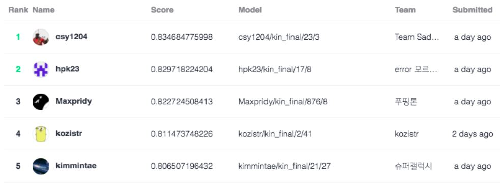
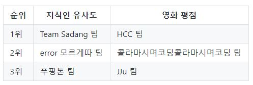

# Naver AI Hackathon 2018 - KIN Question Pairs

[Naver AI Hackathon 2018](https://github.com/naver/ai-hackathon-2018)

**푸핑톤**(Puffington) Team

 - 이상준, 이수진, 신동협 (경기대학교 인공지능 연구실)

**ranked 3rd(over 200 teams, accuracy: 82.27%)**

#### Final Leaderboard

## Features

- CNN filtered 3, 4, 5
- Euclidean distance

## Hyperparameters

|           Name            |   Value    |
| :-----------------------: | :--------: |
|      Training Epoch       |     15     |
|       Learning Rate       |   0.001    |
|        Batch Size         |    256     |
|       Drouout Rate        |    0.5     |
|      Word Embedding       |    32      |

## Results

* Maxpridy/kin_final/876/8
  * **Top Score: 82.27%**

